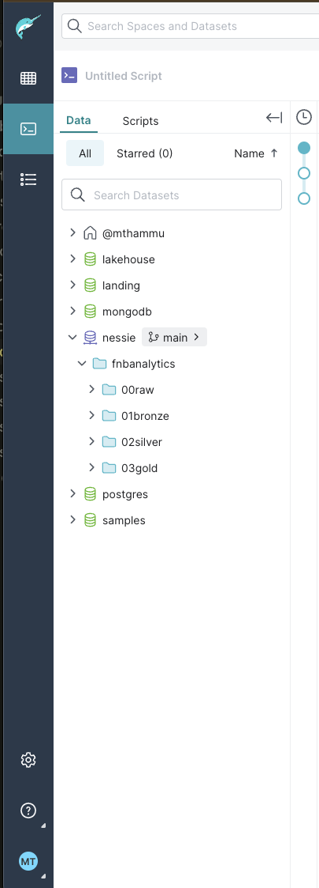
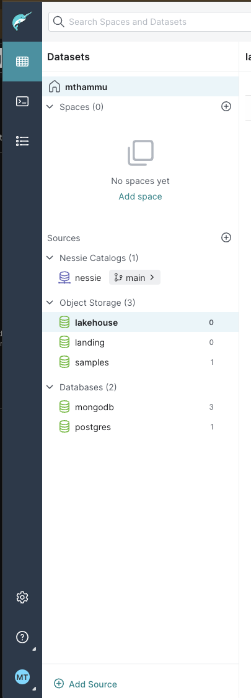

python3 -m venv dbt-env
source dbt-env/bin/activate
python3 -m pip install --upgrade pip
pip install dbt
mkdir dbt_project
cd dbt_project
pip install dagster-dbt
pip install dbt-dremio
dbt init <Project_Name>

dbt run --select my_model

dbt debug
dbt compile
dbt run
dbt test
dbt docs generate
dbt docs serve
dbt docs serve --port 5000

<<<<<<< HEAD
=======
<<<<<<<< HEAD:notes.sql

docker exec -it spark_container /bin/bash
========
>>>>>>> origin/master
<<<<<<< HEAD:notes.sql

docker exec -it spark_container /bin/bash
=======

>>>>>>> origin/master:notes.md
<<<<<<< HEAD
=======
>>>>>>>> origin/master:notes.md
>>>>>>> origin/master

Cloud 9 Linkage
curl -L https://raw.githubusercontent.com/c9/install/master/install.sh | bash
